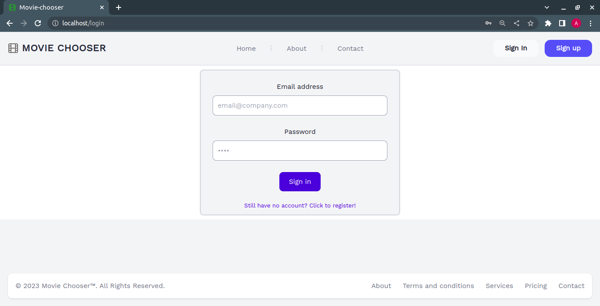

## Introduction

As a movie lover, I always wanted to create a cool website to help make choosing a movie easier. Well, I finally did it. The whole point of this app is to give you a random movie suggestion. And if you're a registered user, you can add, edit, or delete movies. Once you're logged in, you can choose from both movies you've already watched and ones you haven't seen yet. The tools employed in this project include Laravel, Docker, and TailwindCSS.

## Home page

## Random movie

## About page

## Contact page

## Sign up form

## Sign in form

## Home page when signed in

## Add movie form

## Searching movie

## Ticking a movie as watched

